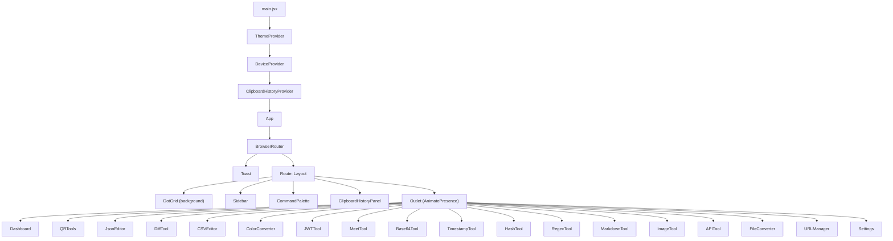
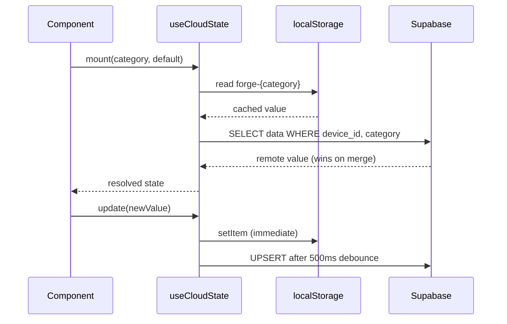

# Forge

A fast, offline-capable developer toolkit that bundles essential day-to-day tools into one clean web app. Built with React, Vite, and Tailwind CSS.

## Features

| Tool | Description |
|------|-------------|
| **QR Tools** | Generate and scan QR codes with customizable size, colors, and error correction |
| **JSON Editor** | Format, validate, minify, tree view, JSON Schema validation, TypeScript/Go conversion, JSONPath queries |
| **Diff Tool** | Compare and merge text or JSON with per-change accept/reject |
| **CSV Editor** | Import, edit, sort, and export CSV data with inline editing |
| **Color Converter** | HEX, RGB, HSL, HSV conversions with palette generation (complementary, analogous, triadic, split-complementary) |
| **JWT Tool** | Decode, verify, and sign JWT tokens (HS256, RS256, ES256) |
| **Meet Quick-Join** | Fast Google Meet launcher with meeting history |
| **Base64** | Encode and decode Base64 text and files |
| **Timestamp Converter** | Unix timestamp and ISO date conversion with live clock |
| **Hash Generator** | SHA-256, SHA-512, SHA-1, MD5 hash generation for text and files |
| **Regex Tester** | Test regex patterns with match highlighting and capture groups |
| **Markdown Preview** | Live markdown editor with rendered preview |
| **Image Tool** | Client-side image resize, compress, and format conversion (PNG, JPEG, WebP) |
| **API Client** | HTTP request builder with headers, auth, body, and response viewing |
| **File Converter** | Convert files between formats (images, documents, data) with client-side processing and optional CloudConvert server support |
| **URL Manager** | Organize bookmarks into color-coded groups with favicon previews, search, drag-and-drop reordering, and sharing |

### Platform Features

- **Progressive Web App** - Install and use offline
- **Cloud Sync** - Data persists across devices via Supabase + Forge ID
- **Command Palette** - Quick navigation with `Cmd+K`
- **Customizable Shortcuts** - Assign `Cmd+0-9` to any tool
- **Theming** - Dark/Light modes, accent colors + custom picker, curated themes (Default, Catppuccin, Nord)
- **Drag-and-Drop** - Drop files onto any tool that accepts file input
- **Export/Import** - Backup and restore all data as JSON
- **Responsive** - Full mobile support with bottom navigation

## Tech Stack

- **React 19** + **Vite 8** - Fast development and production builds
- **Tailwind CSS 4** - Utility-first styling
- **React Router v7** - Client-side routing with lazy loading
- **Framer Motion** - Page transitions and animations
- **CodeMirror 6** - JSON editor with syntax highlighting
- **Supabase** - Cloud data persistence
- **Workbox** - Service worker for offline PWA support

## Architecture

### Component Tree



### Data Flow (`useCloudState`)

Every tool that needs persistent, syncable state uses the `useCloudState(category, defaultValue)` hook. It keeps data in `localStorage` for instant reads and optionally syncs to Supabase for cross-device access.



Key details:
- On mount, `localStorage` is read synchronously for instant UI; a Supabase fetch runs in parallel and overwrites if a remote value exists.
- Writes go to `localStorage` immediately. A debounced (500ms) `UPSERT` syncs to `forge_data` keyed by `(device_id, category)`.
- Payloads exceeding `SOFT_MAX_PERSIST_BYTES` are kept in-memory only and not persisted.
- A `FORGE_STORAGE_IMPORT` custom event triggers all hooks to re-read from `localStorage` after a Settings import.

### State Management

Forge uses **no global store library** (no Redux, Zustand, etc.). State is managed through:

| Layer | Mechanism | Scope |
|-------|-----------|-------|
| **React Context** | `ThemeContext`, `DeviceContext`, `ClipboardHistoryContext` | App-wide settings, device identity, clipboard |
| **`useCloudState` hook** | `localStorage` + Supabase | Per-tool persistent data (e.g. saved QR codes, JSON content, bookmarks) |
| **Component `useState`** | React built-in | Ephemeral UI state within each tool |

## Project Structure

```
forge/
├── public/                  # Static assets, PWA icons
├── src/
│   ├── main.jsx             # Entry point, provider wrappers
│   ├── App.jsx              # Router, lazy-loaded routes
│   ├── index.css            # Global + Tailwind styles
│   │
│   ├── components/          # Shared UI components
│   │   ├── Layout.jsx       #   Shell: sidebar + outlet + command palette
│   │   ├── Sidebar.jsx      #   Navigation (desktop sidebar / mobile bottom bar)
│   │   ├── CommandPalette.jsx#   Cmd+K fuzzy search launcher
│   │   ├── ClipboardHistoryPanel.jsx
│   │   ├── DotGrid.jsx      #   Animated background pattern
│   │   ├── ToolHeader.jsx   #   Consistent header for each tool page
│   │   ├── DropZone.jsx     #   Drag-and-drop file target
│   │   ├── ForgeIcon.jsx    #   Brand icon component
│   │   ├── ForgeEmptyState.jsx
│   │   ├── HelpModal.jsx
│   │   ├── LargeContentBanner.jsx
│   │   └── Toast.jsx
│   │
│   ├── contexts/            # React Context providers
│   │   ├── ThemeContext.jsx  #   Dark/light mode, accents, presets
│   │   ├── DeviceContext.jsx #   Forge ID (anonymous device identity)
│   │   └── ClipboardHistoryContext.jsx
│   │
│   ├── hooks/
│   │   └── useCloudState.js #   localStorage + Supabase sync hook
│   │
│   ├── tools/               # One folder per tool (each has index.jsx)
│   │   ├── Dashboard/       #   Home screen with tool grid + bookmarks
│   │   ├── QRGenerator/
│   │   ├── JsonEditor/
│   │   ├── DiffTool/
│   │   ├── CSVEditor/
│   │   ├── ColorConverter/
│   │   ├── JWTTool/
│   │   ├── MeetTool/
│   │   ├── Base64Tool/
│   │   ├── TimestampTool/
│   │   ├── HashTool/
│   │   ├── RegexTool/
│   │   ├── MarkdownTool/
│   │   ├── ImageTool/
│   │   ├── APITool/
│   │   ├── FileConverter/   #   Sub-components, hooks, services, constants
│   │   ├── URLManager/
│   │   └── Settings/        #   Theme, shortcuts, import/export, FAQ
│   │
│   ├── shortcuts/           # Keyboard shortcut registry + dispatch
│   ├── theme/               # Theme preset configs (Catppuccin, Nord, etc.)
│   ├── lib/                 # Supabase client init
│   ├── utils/               # Shared helpers (copy, parse, format, color)
│   ├── constants/           # Storage limits, etc.
│   └── workers/             # Web Workers (CSV/data parsing)
│
├── vite.config.js           # Vite + React + Tailwind + PWA config
├── eslint.config.js         # ESLint 9 flat config
├── vercel.json              # Vercel deploy settings, SPA rewrites
├── .env.example             # Supabase env var template
└── package.json
```

## Setup

```bash
# Install dependencies
npm install

# Configure environment (optional - for cloud sync)
cp .env.example .env
# Edit .env with your Supabase credentials

# Start development server
npm run dev

# Build for production
npm run build

# Preview production build
npm run preview
```

### Supabase Setup (optional)

To enable cloud sync, create a `forge_data` table in your Supabase project:

```sql
CREATE TABLE forge_data (
  id BIGINT GENERATED BY DEFAULT AS IDENTITY PRIMARY KEY,
  device_id TEXT NOT NULL,
  category TEXT NOT NULL,
  data JSONB,
  updated_at TIMESTAMPTZ DEFAULT NOW(),
  UNIQUE(device_id, category)
);

ALTER TABLE forge_data ENABLE ROW LEVEL SECURITY;

CREATE POLICY "Allow anonymous access"
  ON forge_data FOR ALL
  USING (true) WITH CHECK (true);
```

## Keyboard Shortcuts

| Shortcut | Action |
|----------|--------|
| `Cmd+K` | Open Command Palette |
| `Cmd+1` | QR Tools |
| `Cmd+2` | JSON Editor |
| `Cmd+3` | Diff Tool |
| `Cmd+4` | CSV Editor |
| `Cmd+5` | Color Converter |
| `Cmd+6` | JWT Tool |
| `Cmd+7` | Meet |
| `Cmd+8` | Base64 |
| `Cmd+9` | Timestamp |
| `Cmd+0` | Hash Generator |

Shortcuts can be reassigned in Settings > Keyboard Shortcuts.

## Deployment (Vercel) — two versions only

This project is meant to stay simple: **develop locally**, **ship one production app** on Vercel. No long-lived staging branches required—use `main` (or your default branch) as production.

### One-time setup

1. Push this repo to GitHub/GitLab/Bitbucket.
2. In [Vercel](https://vercel.com) → **Add New Project** → import the repo.
3. Vercel should detect **Vite** and use:
   - **Install Command:** `npm install --legacy-peer-deps` (set in `vercel.json`; also see `package.json` **overrides** for Vite 8 + `vite-plugin-pwa`)
   - **Build Command:** `npm run build`
   - **Output Directory:** `dist`  
   (These match `vercel.json` in the repo.)
4. Under **Environment Variables**, add for **Production**:
   - `VITE_SUPABASE_URL` — your Supabase project URL  
   - `VITE_SUPABASE_ANON_KEY` — Supabase anon key  
   Copy from `.env` / Supabase dashboard. Redeploy after changing env vars.
5. Deploy. Your production URL will be `https://<project>.vercel.app` (or your custom domain).

### Day-to-day workflow

| Where | What |
|--------|------|
| **Local** | `npm run dev` — edit, test, commit |
| **Production** | Push to `main` → Vercel builds and deploys automatically |

Optional: run `npm run build && npm run preview` before pushing to catch production-only issues.

### Supabase + production URL

In Supabase → **Project Settings** → **API** (and **Auth** if you add OAuth later), add your Vercel URL to allowed origins / redirect URLs when required.

### CLI (optional)

```bash
npx vercel        # link & preview deploy
npx vercel --prod # production deploy (after linking)
```

The `.vercel` folder is gitignored; team members link their own CLI or rely on Git integration.

## License

MIT
